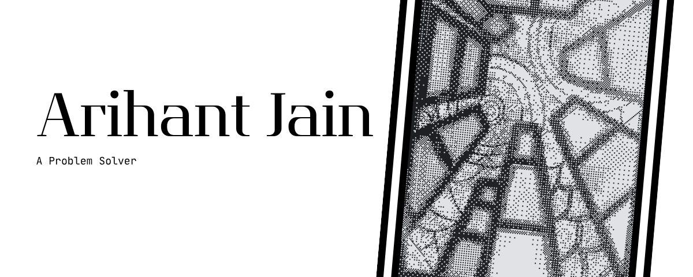

<h1 align="center">Hi, I'm Qwertuhh</h1>  

</a>

-------------------------------------

<!--- snake -->

<picture>
  <source
    media="(prefers-color-scheme: dark)"
    srcset="https://raw.githubusercontent.com/platane/snk/output/github-contribution-grid-snake-dark.svg"
  />
  <source
    media="(prefers-color-scheme: light)"
    srcset="https://raw.githubusercontent.com/platane/snk/output/github-contribution-grid-snake.svg"
  />
  
</picture>

I'm a dedicated student passionate about learning Python libraries and AI engineering. I began my programming journey in 7th grade and have since developed a keen interest in both software design and artificial intelligence.

--------------------------------------------------

<h3 align="left">Connect with me:</h3>

 
  
  

  
<h3 align="left">Languages and Tools:</h3>

  
  
  
  
  
  
  
  
  
  
  
  
  
  
  
  
  
  
  
  
  
  
  
  
  
  
  
  
  
  

----------------------------------------------------------------------

  <!-- Profile viewed-->
  

    
  

  

----------------------------------------------------------------------

----------------------------------------------------------------------

**Feel free to recommend changes!**

**Last Edited on: 5/1/2026**

